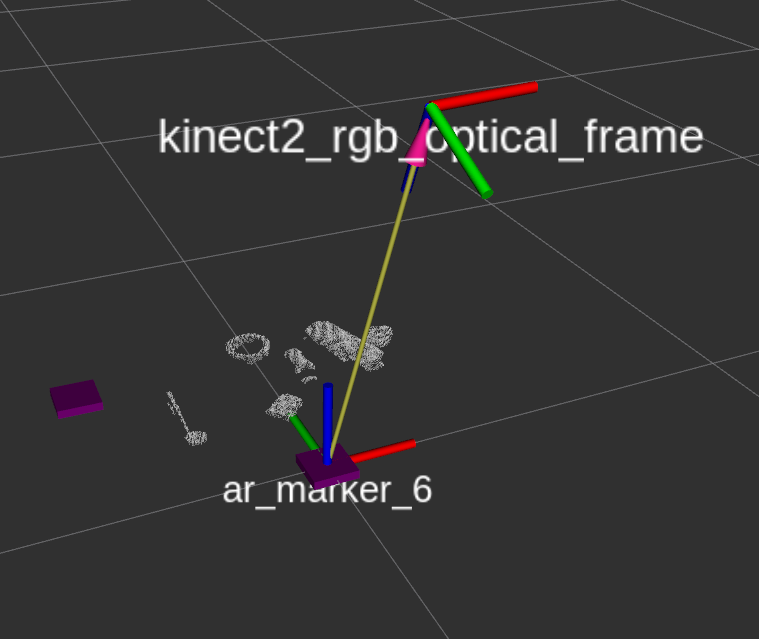

# point_cloud_process
Point cloud pre-process for  PointNetGPD & Kinect v2

基于ROS框架，主要是为了配套PointNetGPD使用的，不过也可以略加修改，变成通用的代码。  

***
## **简介**

- 通过Kinect v2 读取桌面物体的场景点云，并进行系列预处理，保留感兴趣区域点云，支持：
   - 相机坐标系三轴方向直通滤波
   - 剔除支撑桌面
   - 剔除离群点
   - 点云降采样
   - 点云光滑处理
- 通过ROS_tf读取某桌面标签二维码坐标系(目标标签名称为"ar_marker_6")与相机坐标系"kinect2_rgb_optical_frame"之间的坐标关系，从而将感兴趣区域点云转换到桌面标签坐标系中；
- 将预处理后的点云（父坐标系为桌面标签“ar_marker_6”坐标系）以ROS话题形式发布出去，话题名称：
   
   ```
   /table_top_points       #仅滤波剔除桌面等预处理后的点云
   /table_top_points_subsampled      #预处理+降采样
   ```


## 依赖

1. 已经提前安装了ROS并创建了工作空间；

2. 确保已经安装了Kinect深度相机驱动（我们版本是Ubuntu18.04LTS，以及Kinect V2相机）以及相关ROS程序包，并进行了相机内参标定。

	- 先安装Kinect驱动，参见https://github.com/OpenKinect/libfreenect2
	- 再安装Kinect的ROS程序包，参见https://github.com/code-iai/iai_kinect2
	- Kinect标定，参见https://github.com/code-iai/iai_kinect2/tree/master/kinect2_calibration#calibrating-the-kinect-one

3. 安装了[ar_track_alvar](http://wiki.ros.org/ar_track_alvar/)程序包

   ```
   sudo apt-get install ros-<ros_distro>-ar-track-alvar
   ```

4. 确保桌面贴有由[ar_track_alvar](http://wiki.ros.org/ar_track_alvar/)生成的二维码标签并处于深度相机视野范围内，代码中使用的标签编号为6，尺寸10cm*10cm；或直接下载下图

   ```python
   rosrun ar_track_alvar createMarker -f 6 -s 10.0
   ```

   

   

## 安装与使用

1. 克隆到自己的ros工作空间中  
   ```bash
   cd ~/catkin_ws/src
   git clone https://github.com/Hymwgk/point_cloud_process.git
   catkin build
   ```
   
3. 运行本代码之前必须已经提前运行了Kinect v2相机 ，并发布了相应话题： 

   ```bash
   roslaunch kinect2_bridge kinect2_bridge.launch publish_tf:=true
   ```

4. 开始处理桌面点云：
   ```bash
   roslaunch point_cloud_process get_table_top_points.launch 
   ```

6. 启动rviz 对点云进行观察

   ```bash
   rviz
   ```
   
   
7. 修改预处理参数配置文本  `config/prepocess_prarm.txt` 

   该文件指定了与处理过程中的各项参数，程序将在处理每一帧点云之前先读取该文本参数，因此可以直接修改，实时观察预处理点云的变化。

    ```
    pass_through_x=1    设置是否允许相机坐标系x轴方向点云直通滤波
    pass_through_y=1    y轴直通滤波
    pass_through_z=1    z轴直通滤波
    table_remove=1         是否允许剔除支撑桌面
    outlier_remove=1      是否允许剔除离群点   
    surface_smooth=0      是否允许表面平滑
    subsample=0                是否允许降采样
    z_min= 0.3                     设置z轴方向直通滤波的远近距离
    z_max=0.9                      
    x_left= -0.4                    设置x轴方向直通滤波的左右距离
    x_right= 0.3                  
    y_up= -0.25                 设置y轴方向直通滤波的上下距离
    y_down= 0.2             
    remain_rate=0.4             桌面剔除率
    remain_points=500       桌面剩余最少点数
    k_points= 50                   用于剔除离群点
    thresh=0.9                        用于剔除离群点
    radius= 0.03                   用于剔除离群点
    subsampling_leaf_size=0.004              设置降采样voxel尺寸
    ```